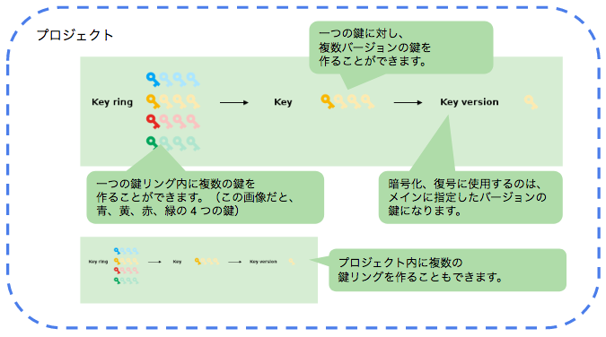

この記事では、GCP の Cloud KMS について調べたことをまとめています。以下の項目について記載しています。

* Cloud KMS の概要
* 鍵の階層構造について（鍵リング、鍵、鍵バージョン）
* セキュリティを考慮した運用
* gcloud による暗号化、復号処理

# Cloud KMS (Cloud Key Management Service) の概要

暗号化、復号に使用する鍵の管理や、鍵による暗号化・復号処理を行うことができるサービスです。

## 主なユースケース

* シークレット（アカウントキーなど）の保護
* 機密性の高いファイルの保護

## 機能一覧

主な機能は次の通りです。

* AES256対称暗号鍵の作成
* 鍵リングの単位で管理できる（一つの鍵リング内で複数の鍵を管理可能）
* バージョン管理ができる（鍵の世代管理）
* 鍵の状態管理（有効、無効、破棄がスケジュール済み、破棄）
* 鍵のローテーションが可能（手動、自動、どちらも可）
* 任意のロケーションに配置可能

以下で、細かく見ていきます。

## 鍵の階層構造について（鍵リング、鍵、鍵バージョン）

Cloud KMS は、鍵リング、鍵、鍵バージョンの三つの階層からなっています。



(画像は https://cloud.google.com/kms/docs/object-hierarchy より引用。一部改変)


### 鍵リング(KeyRing)

一つのプロジェクトに複数の鍵リングを作ることができます。また、一つの鍵リング内に複数の鍵を作ることができます。

鍵リングごとに、権限の設定ができます。そのため、開発プロジェクトごとに鍵リングを作るような管理ができます。

### 鍵(Key)

鍵は世代管理ができます。次の鍵バージョンで説明します。

### 鍵バージョン

鍵は鍵バージョンとして世代管理することができ、実際の暗号化、復号処理に使用するのはメインに指定した鍵バージョンになります。

鍵をバージョン管理することで、セキュリティポリシーに応じた自動ローテートやインシデント時の過去バージョン鍵無効化などの対応を取ることができます。

**バージョン番号の付与のされ方**  
一つの鍵は複数のバージョンを持てます。バージョンは 1 から始まります。鍵をローテーションすると、次のバージョンの鍵が作られます。バージョン番号は 2, 3, 4 というようにインクリメントされていきます。

**メインバージョン**  
鍵にはメインバージョンがあり、特に意識していなければ最新のバージョン番号のものを使用します。手動で古いバージョンをメインにすることもできます。

**暗号化、復号に使用する鍵のバージョン**  
鍵の暗号化は、暗号化した時点でのメインバージョンの鍵で行います。復号時はバージョンを指定する必要はありません。自動的にバージョンが特定されて復号されます。

### 鍵バージョンの状態

鍵バージョンには以下の状態があります。

|状態|説明|
|---|---|
|有効|暗号化、復号が可能な状態|
|無効|暗号化、復号はできない。有効に戻すことが可能|
|破棄がスケジュール済み|間も無く破棄される状態。無効に戻すことが可能|
|破棄|このバージョンの鍵は復元不可。暗号化されたテキストの復号もできない|

なお、鍵をローテーションしても、過去バージョンの鍵は無効にならず有効のままになっています。

[参考：鍵の状態](https://cloud.google.com/kms/docs/key-states)

### その他注意点

鍵リング、鍵は一度作ると削除できません。鍵リング、鍵は課金対象ではありませんが（有効な鍵バージョンと、暗号化・復号処理が課金対象）、画面上に残るので見た目が煩雑になります…

## セキュリティを考慮した運用

では、実際にセキュリティを考慮した運用とするには、どのようにサービスを組み立てて使っていけばいいでしょうか。以下の観点について見ていきます。

* 最小権限で運用する
* インシデント発生時の影響を最小化する
* 監査ログを残す

### 最小権限

各アカウントには職責や役割に応じた必要最小限の権限を与えるようにします。

#### KMS 専用の GCP プロジェクトを立てる

プロジェクトのオーナは鍵に関わる各操作を行うことができます。そのため、開発や本番環境で使用するプロジェクトとは別に KMS 専用のプロジェクトを作ります。

#### 適切な IAM ロールの設定

最小権限にする例として、鍵の管理者と鍵を利用する開発者の二者がいるケースを考えます。この場合は次のようにロールを割り当てます。

|担当者|ロール|
|---|---|
|鍵の管理者|cloudkms.admin|
|開発者|cloudkms.cryptoKeyEncrypterDecrypter<br>storage.objectAdmin|

[参考：職掌分散](https://cloud.google.com/kms/docs/separation-of-duties)

### インシデント発生時の影響を最小化する

#### なぜ鍵のローテーションをする必要があるのか？

各鍵バージョンで暗号化されるテキストが全体ではなく一部になるので鍵バージョン漏洩時の影響を小さくできます。とはいえ、漏洩した場合は再暗号化することが望ましいです。

#### 鍵の漏洩時はどのように対応するか？

もし鍵が漏洩した場合は、漏洩した鍵の不正利用を防ぐために次の流れで鍵の再暗号化をすると良いです。

1. 全ての暗号化されたテキストを復号する
1. 新しいバージョンの鍵を作成する
1. 先ほど復号したテキストを、新しいバージョンの鍵で暗号化する
1. 古いバージョンの鍵を全て破棄する

テキストを復号する前に古いバージョンの鍵を破棄すると、二度と復号できなくなります。注意が必要です。

### 監査ログ

KMS 上のすべての操作ログを残すことができます。詳細はドキュメントをご参照ください。

[Cloud KMS での Cloud Audit Logging の使用](https://cloud.google.com/kms/docs/logging)

## gcloud による暗号化、復号処理

次のコマンドで暗号化、復号処理ができます。

##### 暗号化

```
$ gcloud kms encrypt \
    --key 鍵の名前 \
    --keyring 鍵リングの名前 \
    --location global \
    --plaintext-file=暗号化したいファイルパス \
    --ciphertext-file=暗号化後のファイルパス
```

##### 復号

```
$ gcloud kms decrypt \
    --key 鍵の名前 \
    --keyring 鍵リングの名前 \
    --location global \
    --plaintext-file=復号後のファイルパス \
    --ciphertext-file=暗号化されたファイルパス
```


# 参考

[CLOUD KEY MANAGEMENT SERVICE](https://cloud.google.com/kms/)
[Cloud Key Management Service のドキュメント](https://cloud.google.com/kms/docs/)
[Google Cloud Platform Japan Blog:Cloud KMS を使い暗号化キーの管理をクラウドで](https://cloudplatform-jp.googleblog.com/2017/01/managing-encryption-keys-in-the-cloud-introducing-Google-Cloud-Key-Management-Service.html)
[nouhau:Cloud KMS Introduction](https://github.com/gcpug/nouhau/tree/master/cloudkms/poem/introduction)
