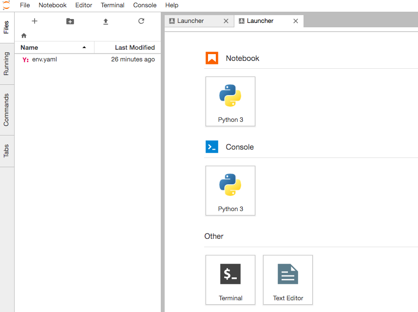

# 概要

Docker Compose で機械学習の環境を構築する。

Anaconda のイメージを元に、Tensorflow、Keras、Chainer をインストールする。

## Docker Compose

### ファイルを用意

##### Dockerfile

```Dockerfile
FROM continuumio/anaconda3
WORKDIR /workspace
RUN conda install -y tensorflow
RUN conda install -y keras
RUN conda install -y chainer
CMD jupyter-lab --no-browser \
  --port=8888 --ip=0.0.0.0 --allow-root
```

##### docker-compose.yml

```yaml
version: '3'
services:
    ml:
        build: .
        volumes:
            - ./workspace:/workspace
        networks:
            - default
        ports:
            - "8888:8888"
```

### イメージのビルド

```
$ docker-compose build
```

### イメージの起動

```
$ docker-compose up -d
```

### Jupyter Lab のページへアクセス

ブラウザでアクセス。私の環境では Docker Toolbox を使用しているため、次のアドレスになる。ローカルホスト上であれば、アドレスをlocalhost に差し替える。

http://192.168.99.100:8888/

token 文字列を入力する必要がある。次のコマンドを実行すると、token 文字列を確認できる。

```
$ docker-compose logs
```

token をブラウザ画面上で入力するとログインできる。


