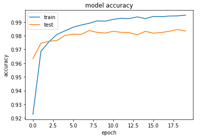
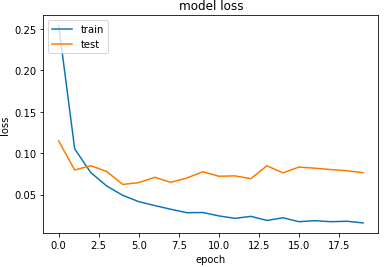

# 環境の動作確認

[1.環境構築](1.環境構築.md)で作成した環境の動作確認を行う。
Keras のサンプルデータセットを用いて確認する。

## Keras

### 使用するサンプルについて

##### データセット

Keras はいくつかデータセットを用意している。このうち、「MNIST 手書き数字データベース」を用いる。

https://keras.io/ja/datasets/


##### サンプルコード

データセット用のサンプルコードも用意されている。

https://github.com/keras-team/keras/blob/master/examples/mnist_mlp.py


### 準備

サンプルコードに若干手を加える。なお、データセットはサンプルコード時にダウンロードされるため、コードさえ準備すれば良い。

作業ディレクトリは、Dockerfile のある場所。以下の手順で作業する。

```shell
$ mkdir workspace/samples
$ cd workspace/samples/
$ wget https://raw.githubusercontent.com/keras-team/keras/master/examples/mnist_mlp.py
```

サンプルコード修正

```python
$ vi mnist_mlp.py

// optimizer が RMSprop だと環境によっては計算が発散するので、Adam にする。
#from keras.optimizers import RMSprop
from keras.optimizers import Adam

// 後ほど pickle を用いるので import。
import pickle

// ここも同様に RMSprop から Adam へ変更。
model.compile(loss='categorical_crossentropy',
#              optimizer=RMSprop(),
               optimizer=Adam(),

// 最終行に追記。
// モデルをファイルに出力。
model.save('mnist.model.h5')   

// History を pickle 化。
with open('/trainHistoryDict', 'wb') as f:
     pickle.dump(history.history, f)            
```

### 実行

```shell
$ docker-compose exec ml python /workspace/samples/mnist_mlp.py
...
Epoch 18/20
60000/60000 [==============================] - 25s 414us/step - loss: 0.0170 - acc: 0.9946 - val_loss: 0.0790 - val_acc: 0.9825
Epoch 19/20
60000/60000 [==============================] - 25s 412us/step - loss: 0.0164 - acc: 0.9946 - val_loss: 0.0884 - val_acc: 0.9817
Epoch 20/20
60000/60000 [==============================] - 25s 411us/step - loss: 0.0170 - acc: 0.9945 - val_loss: 0.0688 - val_acc: 0.9855
Test loss: 0.0687714466689
Test accuracy: 0.9855
```

所要時間は私の PC(Macbook Air 上の Docker Tools 環境)だと約 10 分。
JupyteLab 上で accuracy がエポック毎に上昇していること、loss が順調に下がっていることを確認する。

・Accuracy

```python
import matplotlib.pyplot as plt
import pickle

with open('samples/mnist.history.pickle', mode='rb') as f:
    history = pickle.load(f)

# Accuracy
plt.plot(history['acc'])
plt.plot(history['val_acc'])
plt.title('model accuracy')
plt.xlabel('epoch')
plt.ylabel('accuracy')
plt.legend(['train', 'test'], loc='upper left')
plt.show()
```



・Loss

```python
# Loss
plt.plot(history['loss'])
plt.plot(history['val_loss'])
plt.title('model loss')
plt.xlabel('epoch')
plt.ylabel('loss')
plt.legend(['train', 'test'], loc='upper left')
plt.show()
```


