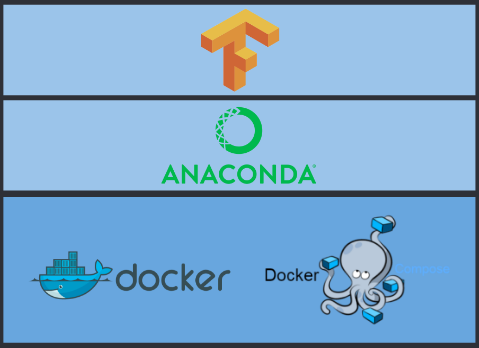
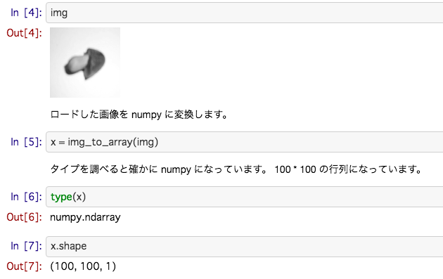

この記事は機械学習初心者の私が、「きのこの山」「たけのこの里」の画像分類のモデルを構築する際に便利だった技術をまとめたものです。

どのように環境構築するか、ニューラルネットライブラリの選定をどうするかを考えたり、こんなに便利な関数があるのだと知ることができたり、発見が多かったです。それらをシェアさせていただければと思います！

# 環境構築

クラウド上で利用できるノートブックなどいろいろ便利なサービスはあるのですが、まずは Macbook 上でいろいろ試したかったです。でも、なるべく環境を汚したくない。分離したい。そのため、Docker を使いました。

このようなスタックにしています。



### Docker

Dockerfile は以下のように Anaconda イメージを元にしています。JupyterLab を起動するようにしています。

```Dockerfile
FROM continuumio/anaconda3
RUN pip install tensorflow
WORKDIR /workspace
CMD ['jupyter-lab', '--no-browser' \
  '--port=8888', '--ip=0.0.0.0', '--allow-root']
```

### Docker Compose

docker コマンドはオプションを覚えるのがめんどくさく、コマンドが長くなりがちです。そのため、Docker Compose を使うことで解消します。なお、ポート番号 8888 は JupyterLab 用、6006 は TensotBoard 用です。

```yaml:docker-compose.yml
version: '3'
services:
    ml:
        build: .
        volumes:
            - ./workspace:/workspace
        networks:
            - default
        ports:
            - "8888:8888"
            - "6006:6006"
```

イメージのビルドは次のコマンドでできます。

```
$ docker-compose build
```

コンテナの起動は次のコマンドで行います。

```
$ docker-compose up -d
```

# 対話型インタフェース

### JupyterLab

プログラムを書く時は、「画像ファイルを numpy 配列にするのはどうやるのだろう？」など、色々なことを試行錯誤しながら書いていきます。試行錯誤の環境は JupyterLab (JypyterNotebook でもいいですが) が便利です。グラフィカルな対話型環境で、一行一行試しながら作業ができます。



JupyterLab は上記の Docker 環境で起動するようにしているので、 http://localhost:8888 にアクセスします。使用するにはトークンの入力が必要なので、```docker-compose logs``` でトークン文字列を確認します。

# ニューラルネットライブラリの選定

### Keras

ニューラルネットを組む際は、初心者ということでコードの書きやすさを重視しました。そのため、[Keras](https://keras.io/ja/) を選定しました。Keras はユーザフレンドリーな設計になっていて書きやすいです。どれくらい簡単かの説明は [30秒でKerasに入門しましょう](https://keras.io/ja/#30keras) をご参照ください。

[Keras は TensorFlow コアに取り込まれています。](https://developers-jp.googleblog.com/2017/12/announcing-tensorflow-r14.html
)よって、TensorFlow をインストールすれば利用することができます。

Keras に限った話ではないのですが、サンプルとして使えるデータセットやサンプルコードがある点も見逃せません。「MNIST 手書き数字データベース」などの例題も簡単に試す事ができます。

[データセット](https://keras.io/ja/datasets/)  
[サンプルコード](https://github.com/keras-team/keras/tree/master/examples)

# 画像ファイルを numpy 配列へ

ニューラルネットのライブラリはどれも numpy 配列でデータを持たせるようになっている気がします。Keras は画像ファイルから numpy 配列にするための便利な関数を用意してくれています。

### load_img

[load_img](https://www.tensorflow.org/api_docs/python/tf/keras/preprocessing/image/load_img) はその名の通り、画像をロードする関数です。[PIL](https://github.com/python-pillow/Pillow) のインスタンスを返却します。

### img_to_array

[img_to_array](https://www.tensorflow.org/api_docs/python/tf/keras/preprocessing/image/img_to_array) も名前が示す通り、画像(PIL インスタンス) から numpy 配列を生成します。

よって、次のように書けば、画像ファイルから numpy 配列を得ることができます。

```python
from tensorflow.keras.preprocessing.image import load_img, img_to_array

img_to_array(load_img(画像ファイルのパス)))
```

# numpy の操作

### 型を調べる

JupyterLab で作業している時、「この変数の型ってリストだっけ、それとも numpy だっけ」と分からなくなる時があります。そういう時は type で確認します。

```python
>>> type(x)
numpy.ndarray
```

### 形状

形状を調べるのは shape です。形状の変換は reshape を使うだけでできます。

```python
>>> x.shape
(100, 100, 1)

# (100, 100, 1) → (100, 100) へ変換
x = x.reshape(100,100)

# １次元配列へ変換
x = x.reshape(10000)
```

# シャッフルや訓練、テストデータの分離を一発で行う

次のように簡単に書けます。

```Python
from sklearn.model_selection import train_test_split

X_train, X_test, y_train, y_test = train_test_split(
    x, y, test_size=0.2)
```

[train_test_split](http://scikit-learn.org/stable/modules/generated/sklearn.model_selection.train_test_split.html) は scikit-learn に含まれる関数です。シャッフルと訓練、テストデータの分離を一発でやってくれる便利な関数です。

**Memo**
X, y で大文字、小文字が異なりますが、数学的な慣習に従った表記なのだそうです。X は 2 次元配列なので大文字、y は 1 次元配列なので小文字となります。『[Pythonではじめる機械学習 ―scikit-learnで学ぶ特徴量エンジニアリングと機械学習の基礎](https://www.oreilly.co.jp/books/9784873117980/)』を読んでいて知りました。

# zip 関数

Python 標準の関数です。二つのリストから値を取ってきたい場合に役立ちます。例えば、以下の処理は外側の for 文で、```categories = ['kinoko', 'takenoko']``` の場合は、

* 1 回目のループで category = kinoko, i = 0
* 2 回目のループで category = takenoko, i = 1

…と処理されます。~~kinoko の方を先にしているのは、私がきのこ派だからです。~~

```Python
for category, i in zip(categories, range(len(categories))):
    for image in images(category):
        x.append(to_nparray(image))
        y.append(i)
```    

# pickle

pickle を使うことで、オブジェクトをファイルとして保存できます。例えば、モデルの loss, accuracy の推移を見るために history を残す用途で活用できます（TensorBoard で十分ではありますが・・）。

```python
# オブジェクトをファイルに保存
with open('ファイルパス', 'wb') as f:
    pickle.dump(history.history, f)

# ファイルから読み出す
with open('ファイルパス', mode='rb') as f:
    history = pickle.load(f)
```

# 一連の流れを教材風にまとめました

今回はきのこ・たけのこの画像分類に取り組んでみましたが、その一連の流れを GitHub 上で教材風にまとめました。（こちらは Keras は TensorFlow 内部のものではなく、別途 Keras をインストールしています）

https://github.com/ao-log/kinoko-takenoko

目次は以下の通りです。

1. ディレクトリ構成
1. 機械学習を行う環境の構築
1. 環境の動作確認をKerasで行う
1. 画像を撮影する
1. 学習用の画像を増やす
1. 学習用データの前処理を行う
1. 学習を行う
1. 推論を行う
